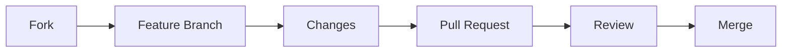

<div align="center">

# 🚀 SmartTask Pro

[](https://github.com/yourusername/Smarttaskpro)
[](https://opensource.org/licenses/MIT)
[](http://makeapullrequest.com)

<p align="center">
  
</p>

### 🎯 Your Ultimate Productivity Companion

<p align="center">
  <a href="#features">Features</a> •
  <a href="#getting-started">Getting Started</a> •
  <a href="#usage">Usage</a> •
  <a href="#customization">Customize</a> •
  <a href="#contributing">Contribute</a>
</p>

---

</div>

## ✨ About

SmartTask Pro is a modern, feature-rich productivity web application designed to help users manage tasks, track time, and boost their productivity. With an intuitive interface and powerful features, it provides everything you need to stay organized and efficient.

<details>
<summary>🌟 Features</summary>

### 🔐 User Authentication
- Secure signup and signin system
- Multi-step verification process
- CAPTCHA verification for enhanced security
- Password strength requirements
- User profile management

### 📋 Task Management
- Create, edit, and delete tasks
- Organize tasks into different categories
- Set task priorities and deadlines
- Track task progress
- Recurring task support

### ⏲️ Pomodoro Timer
- Customizable work and break durations
- Visual and audio notifications
- Session tracking
- Productivity statistics
- Auto-start options

### 📁 Document Management
- Upload and organize documents
- Support for PDF, DOC, and DOCX files
- Document search functionality
- Annotation tools
- Cloud storage integration (coming soon)
  - Google Drive
  - Dropbox

### 🤖 AI Assistant
- Smart task suggestions
- Natural language processing
- Context-aware responses
- Task optimization recommendations
</details>

## 🚀 Getting Started

<details>
<summary>Prerequisites</summary>

- Modern web browser (Chrome, Firefox, Safari, or Edge)
- JavaScript enabled
- Local storage enabled
</details>

<details>
<summary>Installation Steps</summary>

1. Clone the repository:
```bash
git clone https://github.com/yourusername/Smarttaskpro.git
```

2. Navigate to the project directory:
```bash
cd Smarttaskpro
```

3. Open `index.html` in your web browser to start using the application.
</details>

## 💻 Usage

<details>
<summary>1. Create an Account</summary>

- Click "Sign Up" or "Get Started"
- Enter your details and complete the verification process
- Set up your password following the security requirements
</details>

<details>
<summary>2. Task Management</summary>

- Add new tasks using the "+" button
- Set task priorities and deadlines
- Track progress in the dashboard
- Use drag-and-drop to organize tasks
</details>

<details>
<summary>3. Pomodoro Timer</summary>

- Set your preferred work/break durations
- Start the timer and focus on your tasks
- Track your productivity stats
</details>

<details>
<summary>4. Document Management</summary>

- Upload documents through the document manager
- Use the search function to find specific files
- Annotate and organize your documents
</details>

## 🎨 Customization

<details>
<summary>Theme Options</summary>

- Light and dark mode support
- Custom color schemes
- Gradient backgrounds
- Modern UI components
</details>

<details>
<summary>Settings</summary>

- Customize timer durations
- Set notification preferences
- Adjust display options
- Configure cloud storage
</details>

## 🛡️ Security Features

<table>
  <tr>
    <td>🔒 Password Security</td>
    <td>🤖 CAPTCHA Protection</td>
    <td>🔐 Data Safety</td>
  </tr>
  <tr>
    <td>Strong requirements</td>
    <td>Visual verification</td>
    <td>Local encryption</td>
  </tr>
  <tr>
    <td>🔄 Session Management</td>
    <td>✅ Input Validation</td>
    <td>🛠️ Sanitization</td>
  </tr>
  <tr>
    <td>Secure timeout</td>
    <td>Form protection</td>
    <td>XSS prevention</td>
  </tr>
</table>

## 🛠️ Technical Stack

<table>
  <tr>
    <td align="center"></td>
    <td align="center"></td>
    <td align="center"></td>
  </tr>
  <tr>
    <td align="center">HTML5</td>
    <td align="center">CSS3</td>
    <td align="center">JavaScript</td>
  </tr>
</table>

## 📱 Responsive Design

<div align="center">

| Device | Support |
|--------|---------|
| 💻 Desktop | ✅ |
| 💻 Laptop | ✅ |
| 📱 Tablet | ✅ |
| 📱 Mobile | ✅ |

</div>

## 🤝 Contributing

We welcome contributions! Here's how you can help:



1. Fork the repository
2. Create your feature branch (`git checkout -b feature/AmazingFeature`)
3. Commit your changes (`git commit -m 'Add some AmazingFeature'`)
4. Push to the branch (`git push origin feature/AmazingFeature`)
5. Open a Pull Request

## 📄 License

<div align="center">

[](https://opensource.org/licenses/MIT)

This project is licensed under the MIT License - see the [LICENSE.md](LICENSE.md) file for details.
</div>

## 👥 Authors

<div align="center">

|  |
|:---:|
| **Your Name** |
| 🌐 [GitHub](https://github.com/yourusername) |

</div>

## 🙏 Acknowledgments

<div align="center">

| 🎨 Font Awesome | 📝 Google Fonts | 👥 Contributors | 🌍 Open Source |
|----------------|-----------------|----------------|----------------|
| Icons | Typography | Testing | Community |

</div>

## 📞 Support

<div align="center">

[](mailto:support@smarttaskpro.com)
[](https://github.com/yourusername/Smarttaskpro/issues)

</div>

---

<div align="center">

Made with ❤️ by [Your Name]

<a href="#-smarttask-pro">Back to top ⬆️</a>

</div>